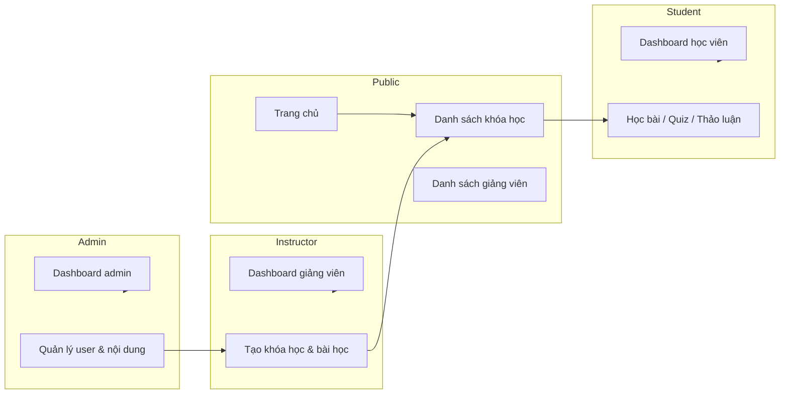

# Giải thích chức năng hệ thống TutorTrek

Tài liệu mô tả chi tiết các chức năng của **Online Course Marketplace** (TutorTrek) theo từng vai trò: **Student**, **Instructor**, **Admin**, cùng các luồng nghiệp vụ chung.

---

## 1. Tổng quan hệ thống

TutorTrek là nền tảng học trực tuyến kết nối:

- **Giảng viên (Instructor)** — tạo và quản lý khóa học, bài học, quiz.
- **Học viên (Student)** — tìm kiếm, đăng ký, học và tương tác.
- **Quản trị viên (Admin)** — giám sát toàn hệ thống, duyệt giảng viên, quản lý người dùng và danh mục.



**Công nghệ chính:** React + TypeScript (client), Node.js + Express + TypeScript (server), MongoDB, Redis, AWS S3, JWT, VNPay, OpenAI (AI Chat).

---

## 2. Xác thực & phân quyền (dùng chung)

| Chức năng | Mô tả |
|-----------|--------|
| Đăng ký / Đăng nhập | Mỗi vai trò có form riêng; dùng JWT access token + refresh token. |
| Google OAuth | Student có thể đăng nhập bằng tài khoản Google. |
| Quên mật khẩu | Gửi email chứa link reset (`/forgot-password` → `/reset-password`). |
| Phân quyền RBAC | API kiểm tra `role`: `student`, `instructor`, `admin`. |
| Session hết hạn | Client tự refresh token; hết hạn thì yêu cầu đăng nhập lại. |

**URL đăng nhập:**

| Vai trò | URL |
|---------|-----|
| Student | `/login` |
| Instructor | `/instructors/login` |
| Admin | `/admin` (trang login admin) |

---

## 3. Chức năng STUDENT (Học viên)

### 3.1. Mục tiêu

Cho phép học viên khám phá khóa học, đăng ký (miễn phí hoặc trả phí), học nội dung, làm quiz, thảo luận và dùng trợ lý AI.

### 3.2. Khu vực công khai (không cần đăng nhập)

| Trang | URL | Chức năng |
|-------|-----|-----------|
| Trang chủ | `/` | Xem **Trending Courses** và **Recommended Courses** (gợi ý theo sở thích nếu đã đăng nhập). |
| Danh sách khóa học | `/courses` | Xem tất cả khóa học; **tìm kiếm** theo từ khóa; **lọc** theo category/level. |
| Chi tiết khóa học | `/courses/:courseId` | Xem mô tả, giá, syllabus, yêu cầu; nút **Enroll Now**. |
| Giảng viên | `/tutors` | Danh sách giảng viên trên nền tảng. |
| Hồ sơ giảng viên | `/tutors/:tutorId` | Thông tin công khai của một giảng viên. |
| Community | `/community` | Trang cộng đồng. |
| About / Contact | `/about`, `/contact` | Giới thiệu & liên hệ. |
| AI Trợ lý | `/ai-chat` | Chat AI hỗ trợ học tập (cần đăng nhập student). |

### 3.3. Đăng ký tài khoản

| Bước | Chi tiết |
|------|----------|
| Đăng ký | `/register` — nhập họ tên, email, mật khẩu, SĐT, **sở thích (interests)** để hệ thống gợi ý khóa học. |
| Đăng nhập Google | Nút Google trên trang login. |
| Quên mật khẩu | `/forgot-password` → email link → `/reset-password`. |

### 3.4. Đăng ký khóa học (Enrollment)

**Khóa học miễn phí:**
1. Vào `/courses/:courseId`
2. Bấm **Enroll Now**
3. Modal xác nhận → **Confirm Enrollment**
4. Hệ thống ghi nhận vào `coursesEnrolled` và collection `enrollments`
5. Nút chuyển thành **Enrolled**

**Khóa học trả phí:**
1. Bấm **Enroll Now** → modal xác nhận
2. Chuyển sang **VNPay** (QR / cổng thanh toán sandbox)
3. Sau thanh toán thành công → tự động enroll + lưu `payment`
4. Quay lại trang khóa học với trạng thái **Enrolled**

### 3.5. Học bài (sau khi đăng ký)

| Trang | URL | Chức năng |
|-------|-----|-----------|
| Xem bài học | `/courses/:courseId/watch-lessons/:lessonId` | Phát video bài giảng (streaming từ S3). |
| Syllabus | Trong trang khóa học | Xem danh sách module/bài học; mở guidelines PDF. |
| Quiz | Trong trang xem bài | Làm câu hỏi trắc nghiệm của bài học. |
| Thảo luận | Trong trang xem bài | Tạo chủ đề, trả lời, sửa/xóa comment của mình. |
| AI Widget | Trong trang khóa học / bài học | Hỏi AI theo ngữ cảnh khóa học (GPT-4o mini). |

### 3.6. Dashboard học viên (`/dashboard`)

| Mục menu | URL | Chức năng |
|----------|-----|-----------|
| Dashboard | `/dashboard` | Tổng quan tiến độ học tập. |
| My courses | `/dashboard/my-courses` | Danh sách khóa đã đăng ký; truy cập nhanh để học tiếp. |
| My profile | `/dashboard/my-profile` | Xem / cập nhật thông tin cá nhân, ảnh đại diện. |
| Settings | `/dashboard/settings` | Đổi mật khẩu. |

### 3.7. Luồng học tập điển hình (Student)

```
Trang chủ → Courses → Chi tiết khóa học → Enroll → Watch lessons → Quiz → Discussion → AI hỗ trợ
```

---

## 4. Chức năng INSTRUCTOR (Giảng viên)

### 4.1. Mục tiêu

Cho phép giảng viên tạo nội dung giáo dục, quản lý khóa học của mình và theo dõi học viên đã đăng ký.

### 4.2. Đăng ký & phê duyệt

| Bước | Chi tiết |
|------|----------|
| Đăng ký | `/instructors/register` — nộp hồ sơ: chứng chỉ, kinh nghiệm, kỹ năng, ảnh. |
| Chờ duyệt | Trạng thái **pending** cho đến khi Admin chấp nhận. |
| Email thông báo | Hệ thống gửi email khi được duyệt hoặc từ chối. |
| Đăng nhập | `/instructors/login` — chỉ instructor đã được duyệt mới sử dụng đầy đủ. |

### 4.3. Menu & trang chính

| Menu | URL | Chức năng |
|------|-----|-----------|
| Home | `/instructors` | **Dashboard**: tổng khóa học, học viên, doanh thu ước tính, hoạt động gần đây. |
| View courses | `/instructors/view-course` | Danh sách khóa học của mình; tìm kiếm/lọc. |
| Add courses | `/instructors/add-course` | Tạo khóa học mới. |
| My students | `/instructors/view-students` | Học viên đã enroll vào khóa của mình (theo từng khóa). |
| My Profile | `/instructors/view-profile` | Cập nhật hồ sơ, ảnh, đổi mật khẩu. |

### 4.4. Tạo & quản lý khóa học

**Khi tạo khóa học (`add-course`), giảng viên nhập:**

| Nhóm | Trường |
|------|--------|
| Thông tin cơ bản | Tiêu đề, mô tả ngắn (about), thời lượng (tuần) |
| Phân loại | Category, level (easy/medium/hard), tags |
| Nội dung | Description, syllabus, requirements |
| Media | Ảnh thumbnail, video giới thiệu, file guidelines (upload S3) |
| Giá | Free hoặc Paid + giá tiền |

**Sau khi tạo:** khóa học hiển thị trên marketplace (có thể cần admin quản lý/duyệt tùy cấu hình).

**Chỉnh sửa khóa học:** `/instructors/edit-course/:courseId`

### 4.5. Quản lý bài học (Lessons)

| Thao tác | URL / màn hình | Chi tiết |
|----------|----------------|----------|
| Xem danh sách bài | `/instructors/view-lessons/:courseId` | Các bài trong một khóa. |
| Thêm bài học | Form trong view-lessons | Upload video, tài liệu; gắn quiz. |
| Sửa bài học | `/instructors/view-lessons/:courseId/edit-lesson/:lessonId` | Cập nhật nội dung, media. |

### 4.6. Quiz (đánh giá)

- Giảng viên tạo **câu hỏi trắc nghiệm** gắn với từng lesson.
- Hỗ trợ nhiều lựa chọn (multiple choice).
- Student làm quiz khi học bài; kết quả lưu trên server.

### 4.7. Theo dõi học viên

- Trang **My students** hiển thị: tên, email, khóa đã đăng ký, ngày tham gia, trạng thái.
- Dữ liệu lấy từ aggregation: khóa học của instructor → `coursesEnrolled` → thông tin student.

### 4.8. Luồng làm việc điển hình (Instructor)

```
Đăng ký → Admin duyệt → Login → Add course → Add lessons → Add quiz → Xem students trên dashboard
```

---

## 5. Chức năng ADMIN (Quản trị viên)

### 5.1. Mục tiêu

Giám sát toàn bộ nền tảng: người dùng, nội dung, doanh thu, danh mục khóa học.

### 5.2. Menu & trang chính

| Menu | URL | Chức năng |
|------|-----|-----------|
| Dashboard | `/admin` | Biểu đồ doanh thu, số khóa học, số instructor/student; thống kê theo tháng. |
| Instructors | `/admin/instructors` | Quản lý giảng viên (xem chi tiết các mục con bên dưới). |
| Students | `/admin/students` | Danh sách học viên; block/unblock. |
| Categories | `/admin/categories` | CRUD danh mục khóa học (Web Dev, Data Science, …). |
| Courses | `/admin/courses` | Xem/sửa/xóa mọi khóa học trên hệ thống. |
| Settings | `/admin/settings` | Đổi mật khẩu admin. |

### 5.3. Quản lý Instructor

| Trang con | URL | Chức năng |
|-----------|-----|-----------|
| Yêu cầu đăng ký | `/admin/instructors/requests` | Xem instructor chờ duyệt. |
| Chi tiết yêu cầu | `/admin/instructors/requests/:id` | Xem hồ sơ, chứng chỉ; **Accept** hoặc **Reject** (có lý do). |
| Instructor bị khóa | `/admin/instructors/blocked` | Danh sách đã block. |
| Xem chi tiết | `/admin/instructors/view/:id` | Hồ sơ đầy đủ của một giảng viên. |
| Block / Unblock | API + UI | Khóa hoặc mở khóa tài khoản; lưu lý do block. |

### 5.4. Quản lý Student

| Chức năng | Mô tả |
|-----------|--------|
| Xem danh sách | Tất cả học viên đã đăng ký. |
| Block student | Chặn truy cập khi vi phạm. |
| Unblock | Khôi phục quyền truy cập. |
| Xem blocked | Danh sách học viên bị khóa. |

### 5.5. Quản lý Categories

| Thao tác | URL |
|----------|-----|
| Danh sách | `/admin/categories` |
| Thêm | `/admin/categories/add-category` |
| Sửa | `/admin/categories/edit-category/:categoryId` |

Category dùng để phân loại khóa học và gợi ý khóa học theo sở thích student.

### 5.6. Quản lý Courses (toàn hệ thống)

| Chức năng | Mô tả |
|-----------|--------|
| Xem tất cả khóa | Danh sách mọi khóa của mọi instructor. |
| Tìm kiếm | Lọc nhanh theo tên/category. |
| Sửa khóa | `/admin/courses/edit/:courseId` — admin có quyền chỉnh sửa nội dung. |
| Xem số lượng đăng ký | Cột enrollment count trên bảng quản lý. |

### 5.7. Dashboard & báo cáo

Admin dashboard hiển thị:

- **Doanh thu theo tháng** (line chart)
- **Số khóa học** đã thêm
- **Số instructor / student**
- Dữ liệu từ collection `payment`, `admin_earnings`, thống kê course

---

## 6. Chức năng chung (cross-cutting)

### 6.1. Thanh toán VNPay

| Bước | Mô tả |
|------|--------|
| Student chọn khóa trả phí | Modal xác nhận giá |
| Tạo giao dịch | Server tạo `orderId`, lưu `payment` trạng thái pending |
| Redirect VNPay | Student thanh toán qua sandbox VNPay |
| Callback | Server xác nhận → enroll student → cập nhật `payouts`, `admin_earnings` |

### 6.2. AI Chat (OpenAI GPT-4o mini)

| Tính năng | Mô tả |
|-----------|--------|
| Chat tổng quát | `/ai-chat` — hỏi đáp học tập. |
| Chat theo khóa | `/ai-chat/course/:courseId` — AI biết ngữ cảnh khóa học. |
| Chat theo bài | `/ai-chat/lesson/:courseId/:lessonId` — hỗ trợ theo bài học cụ thể. |
| Lịch sử | Lưu conversation theo user trong MongoDB (`aiChat`). |
| Đa ngôn ngữ | Hỗ trợ tiếng Việt và tiếng Anh. |

### 6.3. Lưu trữ media (AWS S3)

- Ảnh đại diện (student, instructor)
- Thumbnail khóa học
- Video bài giảng
- File PDF guidelines
- Chứng chỉ instructor khi đăng ký

### 6.4. Cache Redis

- Cache danh sách khóa học (`all-courses`)
- Cache kết quả tìm kiếm
- Cache thông tin student (giảm tải MongoDB)

### 6.5. API Documentation (Swagger)

- URL: `http://localhost:4000/api/docs`
- Mô tả các endpoint: auth, courses, admin, enrollment, v.v.

---

## 7. Cơ sở dữ liệu chính (theo vai trò)

| Collection | Liên quan vai trò | Mô tả ngắn |
|------------|-------------------|------------|
| `students` | Student | Tài khoản, profile, interests, coursesEnrolled |
| `instructor` | Instructor | Hồ sơ, chứng chỉ, trạng thái duyệt/block |
| `admin` | Admin | Tài khoản quản trị |
| `course` | Instructor, Student | Khóa học, giá, thumbnail, coursesEnrolled |
| `lessons` | Instructor, Student | Bài học, video |
| `quiz` | Instructor, Student | Câu hỏi đánh giá |
| `discussions` | Student | Thảo luận theo lesson |
| `payment` | Student, Admin | Giao dịch VNPay |
| `enrollments` | Student | Bản ghi đăng ký riêng (studentId + courseId) |
| `achievements` | Student | Thành tích khi enroll/hoàn thành |
| `bookmarks` | Student | Đánh dấu khóa/bài yêu thích |
| `payouts` | Instructor, Admin | Tiền trả cho giảng viên |
| `admin_earnings` | Admin | Phần doanh thu platform |
| `categories` | Admin, Instructor | Danh mục khóa học |
| `aiChat` | Student | Lịch sử chat AI |

---

## 8. Bảng tóm tắt quyền theo vai trò

| Chức năng | Student | Instructor | Admin |
|-----------|:-------:|:----------:|:-----:|
| Xem danh sách khóa học | ✅ | ✅ | ✅ |
| Đăng ký khóa học | ✅ | ❌ | ❌ |
| Học video / làm quiz | ✅ (sau enroll) | ❌ | ❌ |
| Tạo / sửa khóa học | ❌ | ✅ (của mình) | ✅ (mọi khóa) |
| Thêm bài học | ❌ | ✅ | ❌ |
| Duyệt instructor | ❌ | ❌ | ✅ |
| Block user | ❌ | ❌ | ✅ |
| Quản lý category | ❌ | ❌ | ✅ |
| Xem dashboard thống kê | ✅ (cá nhân) | ✅ (của mình) | ✅ (toàn hệ thống) |
| Thanh toán VNPay | ✅ | ❌ | ❌ |
| AI Chat | ✅ | ❌ | ❌ |
| Thảo luận bài học | ✅ | ❌ | ❌ |

---

## 9. Ví dụ kịch bản sử dụng

### Kịch bản A — Student học khóa miễn phí

1. Đăng nhập `student1@tutortrek.com`
2. Vào **Courses** → chọn khóa **Free**
3. **Enroll Now** → **Confirm Enrollment**
4. Vào **Dashboard → My courses** → **Watch lessons**
5. Làm quiz, tham gia discussion, hỏi AI nếu cần

### Kịch bản B — Instructor tạo khóa mới

1. Đăng nhập instructor đã được duyệt
2. **Add courses** → điền form + upload media
3. **View courses** → chọn khóa → **View lessons**
4. Thêm từng bài học + quiz
5. Theo dõi học viên tại **My students**

### Kịch bản C — Admin vận hành nền tảng

1. Đăng nhập admin
2. **Instructors → Requests** → duyệt instructor mới
3. **Categories** → thêm/sửa danh mục
4. **Students** → block tài khoản vi phạm nếu cần
5. **Dashboard** → xem doanh thu và tăng trưởng

---

## 10. Liên kết tài liệu khác

- [HUONG_DAN_CHAY.md](./HUONG_DAN_CHAY.md) — Hướng dẫn cài đặt và chạy project
- Swagger API: `http://localhost:4000/api/docs` (khi server đang chạy)

---

*TutorTrek — Design and Implementation of an Online Course Marketplace*
